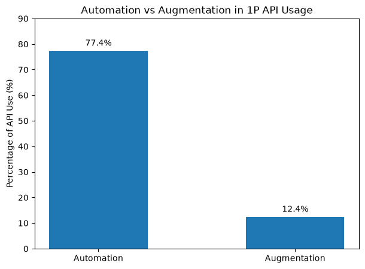
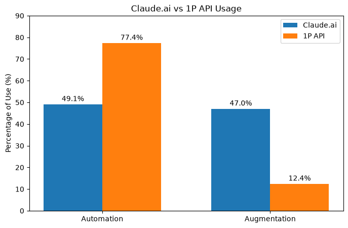
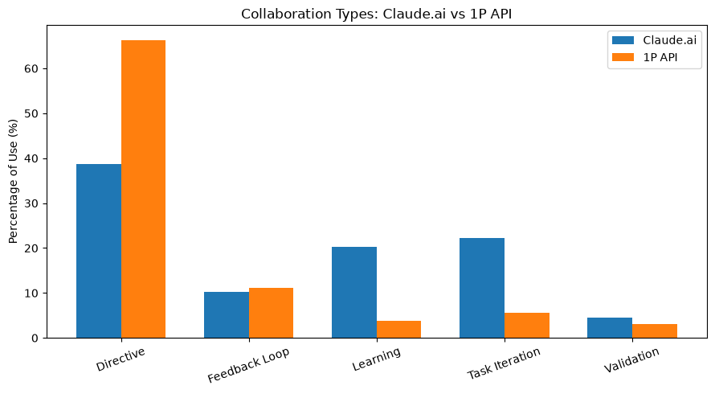
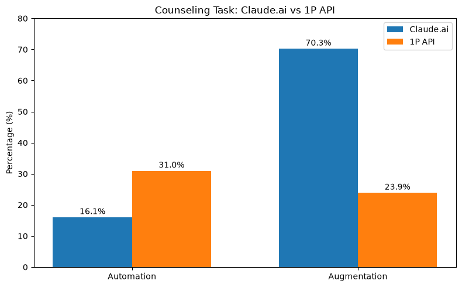
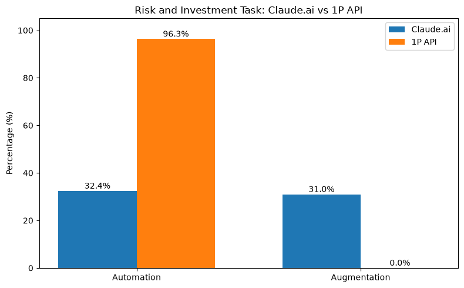

# Data Profile

## 1P API: Automation vs Augmentation

**Figure 1.** Automation is much more common than augmentation in the 1P API data. About 77.4% of API use is automation, while about 12.4% is augmentation.

## Claude.ai vs 1P API

**Figure 2.** Claude.ai has similar levels of automation and augmentation. In comparison, 1P API use is much more focused on automation. This shows a clear difference between consumer and business AI use.

## Collaboration Types

**Figure 3.** The largest difference is in directive use, which is much higher for the 1P API. Claude.ai has higher percentages for learning and task iteration. This suggests that business API use is more focused on direct task completion, while consumer use includes more interactive collaboration.

## Same-Task Analysis

This week, I extended the analysis to compare Claude.ai and 1P API usage on the same O*NET tasks. I selected two tasks from the dataset and compared their collaboration patterns.

### Task 1: Counseling

The first task was:

"Advise clients on how they could be helped by counseling."

For this task, the 1P API had 30.98% automation and 23.91% augmentation. Claude.ai had 16.06% automation and 70.26% augmentation.

This task shows a large difference between the two platforms. Claude.ai had much more augmentation, especially because learning was 56.93%. The API had a higher automation percentage than Claude.ai.

### Task 2: Risk and Investment

The second task was:

"Analyze and classify risks and investments to determine their potential impacts on companies."

For this task, the 1P API had 96.32% automation and no usage classified as augmentation. Claude.ai had 32.39% automation and 30.99% augmentation.

The API usage for this task was almost entirely directive, while Claude.ai showed both directive and learning patterns.

### Initial Observation

These two examples show that Claude.ai and the 1P API can have different collaboration patterns even when they are used for the same O*NET task. This provides an initial example related to my research question: "Do consumers and businesses use AI differently on the same tasks?"

These results are based on only two selected tasks, so more tasks need to be analyzed before making a general conclusion.

## Research Question (Q3)
Do consumers (Claude.ai) and businesses (1P API) use AI differently on the
same tasks? Specifically, I wanted to know whether businesses lean more
toward full automation while individual users lean more toward augmentation,
even when working on the exact same O*NET task.

## Hypotheses

| | Statement |
|---|---|
| **H0** | No difference in automation share between API and Claude.ai for the same task: `mean(diff) = 0` |
| **H1** | Automation share is systematically higher on the API than on Claude.ai: `mean(diff) > 0`, where `diff(t) = automation%_API(t) - automation%_ClaudeAI(t)` |

**Reasoning:** businesses using the API are usually optimizing for cost and
efficiency, pushing tasks toward full automation. Individual users on
Claude.ai are more often learning, exploring, or want to stay in control of
the process, so they stay closer to augmentation.

## Data and Method
Data: Aug 2025 release (`aei_raw_1p_api_2025-08-04_to_2025-08-11.csv` and
`aei_raw_claude_ai_2025-08-04_to_2025-08-11.csv`). For each source, I
filtered to task-level collaboration data
(`facet == "onet_task::collaboration"`, `variable ==
"onet_task_collaboration_pct"`), split `cluster_name` into task name and
collaboration type, and grouped collaboration types into two buckets:

- **Automation** = directive + feedback loop
- **Augmentation** = learning + task iteration + validation

I matched every task present in both sources (global level) and computed
`diff = automation%_API - automation%_ClaudeAI` for each of the 1,193
matched tasks. To test H1, I ran a one-tailed paired t-test
(`scipy.stats.ttest_rel`, `alternative = "greater"`).

## Results

| Metric | Value |
|---|---|
| Matched tasks (n) | **1,193** |
| Mean diff (API − Claude.ai) | **+31.03 pp** |
| Median diff | **+31.43 pp** |
| t-statistic | **63.26** |
| p-value | **< .001** |
| Conclusion | **Reject H0 → H1 supported** |

The p-value is far below the 0.05 threshold, so H0 is rejected in favor of
H1. Across almost all matched tasks, the API automation share is higher
than the Claude.ai automation share by about 31 percentage points on
average — a large, statistically significant gap unlikely to be due to
random noise.

## Interpretation and Limitations
This result supports the idea that businesses and individuals use the same
underlying model differently, even on the same task. Since this is based on
a single time period (Aug 2025) and only the automation/augmentation split
from collaboration type, it does not yet address:

- whether the gap is larger for high-complexity/high-wage occupations (H2)
- whether the gap changes across later releases (H3)

Both are planned for the next phase, once the newer release's schema
(Jun 2026) is harmonized — it stores this information differently
(pre-computed `collaboration_bucket_automation_pct` metric instead of raw
collaboration-type rows).
